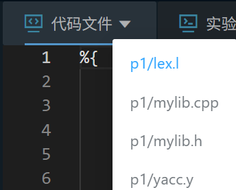
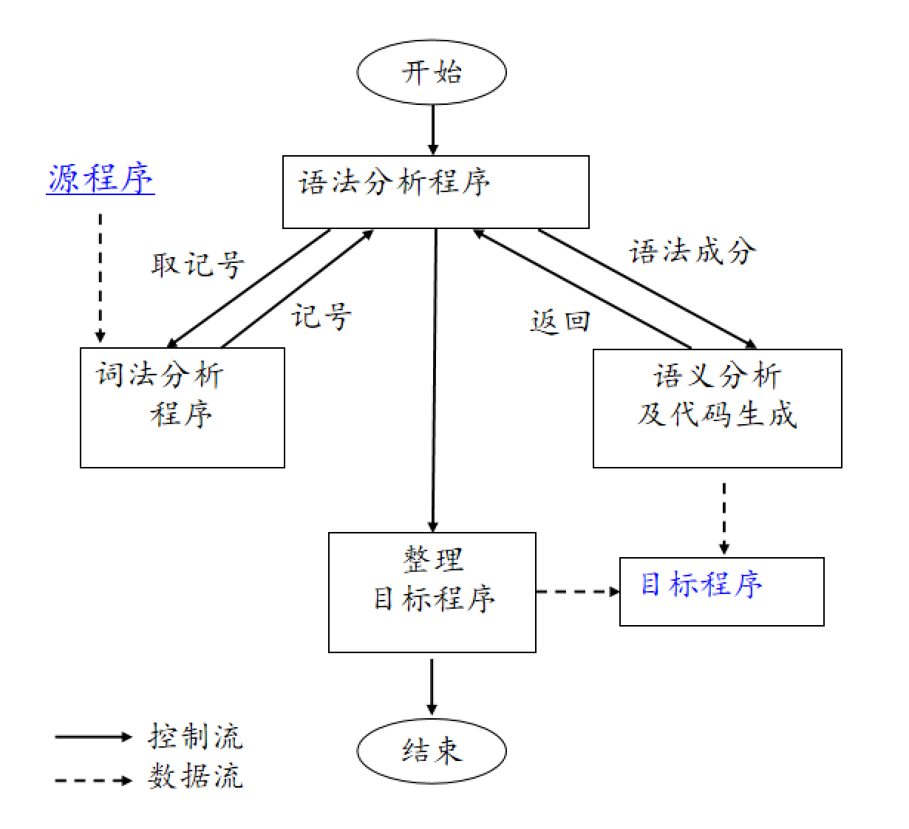
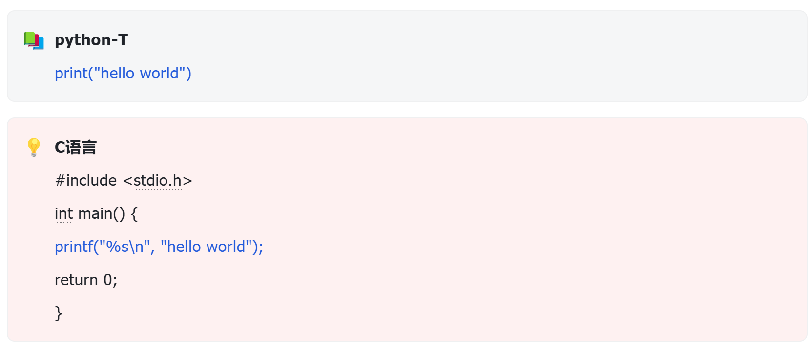

# 任务描述
设计并实现一个 python-T 到 C 语言的编译器，该编译器能够将简单的 Python 代码转换为等效的 C 语言代码。
## 平台说明
为了简化难度，本次实验推荐使用lex和bison工具。实验平台将呈现四个文件：lex.l、yacc.y、mylib.cpp和mylib.h，其中yacc文件会作为主体程序，而lex文件传递所需的token流，mylib.cpp和mylib.h提供所需的辅助函数。

鉴于设计思路会有差异，这四个文件都将交由同学们自行填写。
## 测试说明
本次平台的测试范围包括：简单输出、简单赋值、list结构、if结构、for循环、函数、类等。

测试步骤如下：

平台调用文件联合编译出可执行文件compiler;
测试例文件，例如t1.py作为输入，经complier得到翻译程序t1.c;
运行t1.c得到输出文件，并与t1.py的预期结果进行比对。
所涉及的测试例均为正确完整的基础测试例，不包含错误和注释部分。
除通过平台外，鼓励同学们进行扩展，完善编译器的主要功能，例如增加类型检查、多重结构嵌套、错误处理、注释处理等部分，自行编写测试例并在本地运行通过，可写进报告中作为加分项。
## 设计说明
下述展示了推荐使用的程序流程框图：

本次实验重心将落于语义分析和代码生成阶段，除程序主题框架外，每个语句都应设计对应的翻译方案。

## 示例
以print("hello world")的翻译过程为例。

**转换图**
```
Python代码                    分析过程                      C代码
+----------------+           +----------------+           +--------------------+
| print("hello   | --------> | PRINT(STR)     | --------> | printf("%s\n",     |
| world")        |           |                |           | "hello world");    |
+----------------+           +----------------+           +--------------------+
```
**翻译过程**
1) 词法分析
将源代码分解成基本单元：
```c
print  →  识别为关键字 "PRINT"
(      →  识别为左括号
"hello world"  →  识别为字符串变量
)      →  识别为右括号
```
2) 语法分析
根据语法规则识别词法单元构成的结构：
```c
print_stmt: PRINT '(' args ')'
```
3) 语义分析及代码生成
```c
print_stmt  : PRINT '(' args ')' {
// 1. 确定参数类型并构建格式字符串："hello world" 对应 %s 格式
    char* format = build_format_string($3);
// 2. 生成printf调用
    char buf[1024];
    snprintf(buf, sizeof(buf), "    printf(%s, %s);\n", format, $3);
//3. 将生成的代码添加到缓冲区
    append_to_buffer(buf);
    
    if (format) free(format);
}
;
```
**关于yacc**
在合适的地方补充语义动作以实现格式化输出，是常见的翻译策略。在上述例子中，$3表示引用当前语法规则右侧第三个符号的值。当前语法规则是 print_stmt : PRINT '(' args ')'，则：
```c
PRINT 是第1个符号（$1）
'(' 是第2个符号（$2）
args 是第3个符号（$3）
')' 是第4个符号（$4）
```
所以对于 print("hello world") 这样的输入，$3 将包含 "hello world" 这个字符串。

如果语义信息不能立刻被利用，那么就需要一定的区域进行存放。故而符号表的设计非常关键，它决定了应该存储的符号范围及其背后的属性，以便在需要的时候查找使用。
# 文法说明
1. 本次文法较之前版本进行了修改和完善。主要目的是修改部分结构以规避可能存在的语法冲突，所覆盖的python语言基本与前两次实验一致。较为明显的改动出现在if结构的语法上，这是因为if-elif-else和for-else存在块重叠，所以不得不在语法名称上进行区分。
2. 下述文法经测试证明了可行性，供大家参考。如果存在程序设计的需求，也可以对文法进行合适的等价变换。
```c
file        : statements ENDMARKER
            ;
statements  : statements statement
            | /* empty */
            ;
statement   : compound_stmt
            | simple_stmts
            ;
compound_stmt : if_stmt
              | function_def
              | for_stmt
              | class_def   
              ;
simple_stmts : simple_stmt_list NEWLINE
             ;
simple_stmt_list : simple_stmt
                 | simple_stmt_list ';' simple_stmt
                 ;
simple_stmt : assignment
            | print_stmt
            | method_call
            | declaration
            | return_stmt
            | PASS
            ;
class_def : CLASS IDENTIFIER ':' block
            ;
function_def : DEF IDENTIFIER '(' parameters ')' ARROW TYPE ':' block
             | DEF IDENTIFIER '(' parameters ')' ARROW IDENTIFIER ':' block
             | DEF IDENTIFIER '(' parameters ')' ':' block
             ;
parameters  : parameter_list
            | /* empty */
            ;
parameter_list : parameter
               | parameter_list ',' parameter
               ;
parameter   : IDENTIFIER ':' TYPE
            | IDENTIFIER ':' IDENTIFIER
            ;
return_stmt : RETURN expression
            | RETURN
            ;
if_stmt : IF expression ':' block if_continuation
        ;
if_continuation : ELIF expression ':' block if_continuation
                | ELSE ':' block
                | /* empty */
                ;
for_stmt : FOR IDENTIFIER IN for_expr ':' block else_block
         ;
for_expr    : IDENTIFIER
            | range_expr
            | list
            ;
else_block  : /* empty */
            | ELSE ':' block
            ;
range_expr  : RANGE '(' range_params ')'
            ;
range_params : expression
             | expression ',' expression
             | expression ',' expression ',' expression
             ;
expression  : or_expr
            ;
or_expr     : and_expr
            | or_expr OR and_expr
            | NOT or_expr
            ;
and_expr    : compare_expr
            | and_expr AND compare_expr
            ;
compare_expr : arithmetic_expr
             | arithmetic_expr REL_OP arithmetic_expr
             ;
arithmetic_expr : term
                | arithmetic_expr ADD_OP term
                ;
term        : factor
            | term MUL_OP factor
            ;
factor      : '(' expression ')'
            | NUMBER
            | TRUE
            | FALSE
            | list
            | IDENTIFIER '(' args ')'
            | IDENTIFIER '(' ')'
            | target
            | STR
            | ADD_OP factor
            ;
list        : '[' list_elements ']'
            ;
list_elements : /* empty */
              | expression_list
              ;
expression_list : expression
                | expression_list ',' expression
                ;
print_stmt  : PRINT '(' args ')'
            ;
args        : arg
            | args ',' arg
            ;
arg         : expression
            ;
assignment  : target '=' expression
            | target ASSIGN_OP expression
            ;
target      : IDENTIFIER
            | target '.' IDENTIFIER
            | target '[' expression ']'
            ;
method_call : target '.' APPEND '(' expression ')'
            | target '.' IDENTIFIER '(' args ')'
            ;
declaration : target ':' TYPE
            | target ':' TYPE '=' expression
            | target ':' IDENTIFIER '=' expression
            ;
block       : NEWLINE INDENT statements DEDENT
            | simple_stmts
            ;
```

# tips
1. 前两次实验的程序大部分可以复用，但仍需进行适量的修改。这是因为之前实验所涉及到的文法是第三次实验的简化版，所以直接照搬可能会出问题，最好检查一下文法范围和程序逻辑。
2. C语言本身没有布尔型，可以考虑引入#include <stdbool.h>，将python中的True映射为true就可行了。
3. 关于浮点数，%f默认显示 6 位小数。如果想更接近Python的风格，可以使用%g, 这样C语言输出的浮点数将会以最简洁的形式显示数值

---

开始你的任务吧，祝你成功！